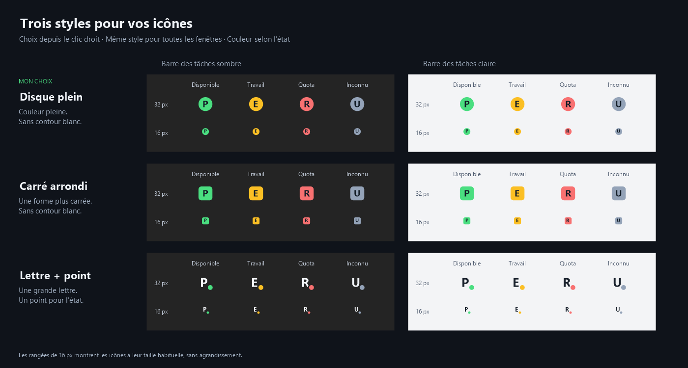

# Codex Status Icons

**Français** · [English](README.md) · **Version 1.0.0**

Suivez Codex dans vos fenêtres VS Code depuis la zone de notification Windows. Chaque fenêtre locale ou SSH possède une icône avec la lettre du projet, la couleur de son état et la durée du travail en cours. Un clic ramène à sa fenêtre VS Code existante.

Codex Status Icons est un projet communautaire indépendant, sans affiliation officielle avec OpenAI ou Microsoft. Le compagnon Windows, l'extension VS Code et le composant SSH sont tous en version **1.0.0**.



## Installation

Prérequis : **Windows x64**, **VS Code 1.96 ou plus récent**, et l'extension officielle **OpenAI Codex** (`openai.chatgpt`) installée là où Codex travaille, avec son compte déjà connecté.

1. Téléchargez **[codex-status-1.0.0.vsix](https://github.com/QuentinQuiros/codex-status-icons/releases/download/v1.0.0/codex-status-1.0.0.vsix)** depuis la [release 1.0.0](https://github.com/QuentinQuiros/codex-status-icons/releases/tag/v1.0.0). Le ZIP du code source sert au développement.
2. Dans VS Code, ouvrez les Extensions avec **Ctrl+Maj+X**, puis **… → Installer à partir d'un VSIX…** et choisissez ce fichier. Vous pouvez aussi utiliser **Ctrl+Maj+P → Extensions: Install from VSIX…**.
3. Rechargez les fenêtres existantes si demandé, avec **Ctrl+Maj+P → Developer: Reload Window**.
4. Repérez la lettre du projet près de l'horloge Windows, ou dans le menu des icônes masquées **^**. Le compagnon Windows démarre automatiquement.

Installation facultative en ligne de commande :

```powershell
code --install-extension .\codex-status-1.0.0.vsix
```

Aucun droit administrateur, aucune installation séparée de Node.js ou de .NET n'est nécessaire pour utiliser le VSIX. L'extension s'installe une seule fois sur votre PC et fonctionne automatiquement dans les nouvelles fenêtres VS Code.

### SSH

Installez le VSIX principal **localement sur Windows**, puis ouvrez votre workspace Remote SSH. Le **composant SSH 1.0.0**, inclus dans le package, s'installe automatiquement sur l'hôte, une seule fois par hôte. Il utilise VS Code Server et le binaire officiel Codex déjà présents. Ni Python ni .NET ne sont nécessaires sur le serveur.

Rechargez les fenêtres SSH existantes après une mise à jour. Si le diagnostic indique `remote_bridge_reload_required`, rechargez une seconde fois pour remplacer le composant encore chargé en mémoire. Le VSIX distant proposé séparément est facultatif, le package principal l'inclut déjà.

Une fenêtre SSH minimisée peut recevoir les commandes VS Code avec retard. L'icône attend jusqu'à 75 secondes une réponse et conserve le dernier état confirmé pendant cette attente. Les changements et notifications peuvent alors arriver environ une minute plus tard. Une erreur explicite de connexion rend l'état inconnu. [Guide SSH](docs/SSH_SUPPORT.md).

## Couleurs et quotas

| Couleur | Signification |
| --- | --- |
| Vert | Codex est disponible. |
| Orange | Codex travaille. |
| Rouge | Codex a épuisé le quota. |
| Gris | L'état actuel de Codex ne peut pas être confirmé. |

Le vert exige une activité de session récente. Ouvrir une ancienne conversation ne suffit pas à établir la disponibilité. L'activité technique d'une session expire après **60 minutes** par défaut, ce délai est configurable par workspace.

Un blocage confirmé du compte prime sur la session. Les quotas sont vérifiés au démarrage puis toutes les **30 secondes**, sur la machine où Codex travaille. Des crédits achetés ou illimités encore utilisables évitent un état rouge fondé seulement sur un usage à 100 %. Lorsque le compte redevient disponible, l'icône reprend l'état courant de la session.

Survolez une icône pour voir son projet, son état, la durée du travail et les périodes de quota disponibles, par exemple **[5h : 72% | 7j : 84%]**. Il s'agit du **quota restant**, arrondi à l'entier inférieur, chaque période est indépendante. La ligne disparaît si les données manquent, sont anciennes, expirées ou déconnectées. Le quota n'est jamais estimé depuis les textes des conversations.

## Notifications et sons

Les notifications Windows sont activées par défaut pour une fin de tâche confirmée (**orange → vert**) ou une interruption liée au quota (**orange → rouge**). Cliquez sur la notification pour retrouver la fenêtre VS Code concernée. Le démarrage, la reconnexion, une annulation manuelle et les états inconnus ne produisent pas de notification de fin de tâche. Windows décide de l'affichage des bannières, notamment avec le mode Ne pas déranger.

**Paramètres → Notifications** propose quatre sons :

- **ChatGPT** : le son de notification intégré, choisi par défaut.
- **Son Windows** : le son de notification Windows.
- **Silencieux** : une bannière sans son.
- **Son personnalisé** : un fichier WAV PCM local, 8 ou 16 bits, mono ou stéréo, jusqu'à 30 secondes et 5 Mo.

L'activation des notifications et leur son concernent **toutes les fenêtres locales et SSH**. **Tester la notification** permet d'essayer le choix avant d'enregistrer. Un fichier personnalisé reste à son emplacement d'origine, le déplacer ou le supprimer empêche son son de jouer. Le son démarre uniquement lorsque Windows signale l'affichage de la bannière.

## Paramètres et apparence

Un clic droit sur une icône ouvre **Paramètres**, **Aide / À propos**, le menu de style ou celui de taille.

**Paramètres** comporte trois onglets :

| Onglet | Options | Portée |
| --- | --- | --- |
| Général | Langue de l'interface, expiration de l'état d'une session. | Langue : toutes les fenêtres. Expiration : workspace choisi. |
| Notifications | Activation, choix et test du son. | Toutes les fenêtres. |
| Icônes | Lettre personnalisée, explications pour la visibilité Windows. | Lettre : workspace choisi. Visibilité : Windows. |

L'interface propose **Automatique**, **Français** et **English**. Automatique utilise le français sur un Windows français, l'anglais sinon. Les noms de commandes et descriptions des réglages dans VS Code suivent la langue d'affichage de VS Code.

La lettre accepte une lettre ou un chiffre, laissez le champ vide pour une initiale automatique. L'expiration accepte **5 à 1440 minutes** et conserve les valeurs personnalisées dans sa liste modifiable. **Enregistrer** applique les changements, **Annuler** conserve les valeurs précédentes. Dans une fenêtre sans dossier, les options du workspace sont enregistrées globalement.

Les trois styles sont **Disque plein**, **Carré arrondi** et **Lettre + point**. Les trois tailles sont **Petite**, **Moyenne** et **Grande**. Style et taille concernent toutes les icônes et sont conservés au redémarrage. Windows fixe la taille de l'emplacement système, le réglage change la place occupée par le dessin dans cet emplacement. [Aperçu des tailles](icons/sizes-preview.png).

### Garder les icônes visibles près de l'horloge

Sous Windows 11 :

1. Faites un clic droit sur une de nos icônes, même dans **^**, puis **Paramètres → Icônes**.
2. Cliquez sur **Ouvrir les paramètres Windows…**.
3. Dépliez **Autres icônes de barre d'état système** dans les paramètres de la barre des tâches.
4. Activez chaque ligne **Codex Status Icons** souhaitée près de l'horloge. La lettre identifie sa fenêtre VS Code. Désactiver une ligne remet son icône dans **^**.

Sous Windows 10, utilisez **Zone de notification → Sélectionner les icônes à afficher dans la barre des tâches**.

Le compagnon conserve un emplacement d'exécutable fixe et une identité d'icône stable par workspace, permettant à Windows de mémoriser votre choix entre les versions. Le premier choix se fait dans Windows. Deux fenêtres simultanées du même workspace ont des emplacements distincts, attribués selon leur ordre d'ouverture.

## Aide et dépannage

**Aide / À propos** présente les versions des composants, les couleurs, la documentation et **Copier les diagnostics**. Le rapport contient les informations techniques du projet et ses chemins, les versions, l'état, les raisons et les préférences, sans prompts, réponses ou identifiants de connexion. Rien n'est envoyé automatiquement.

Dans VS Code, utilisez **Ctrl+Maj+P** :

- **Codex Status : afficher les diagnostics** pour examiner la fenêtre choisie.
- **Codex Status : redémarrer** pour relancer le compagnon Windows.
- **Codex Status : associer une session à cette fenêtre** pour choisir une session technique si l'association automatique est ambiguë.

Une icône grise explique sa cause connue dans l'infobulle et le menu, par exemple l'absence d'activité récente, une session expirée, une connexion SSH indisponible ou un rechargement nécessaire. Chaque icône disparaît quand sa fenêtre se déconnecte. Le compagnon quitte 15 secondes après la dernière déconnexion.

Pour arrêter l'affichage des icônes, désactivez **Codex Status Icons** dans le panneau **Extensions** de VS Code, pour le workspace choisi ou globalement. Réactivez l'extension pour les retrouver.

[Référence des réglages](docs/CONFIGURATION.md) · [Vérifications manuelles](docs/MANUAL_TESTS.md)

## Confidentialité et environnements pris en charge

Les fichiers de session sont lus par portions limitées pour extraire les métadonnées et événements techniques. Les prompts et réponses ne sont ni conservés ni transmis au compagnon. Les vérifications du compte utilisent l'app-server officiel Codex et sa connexion existante, notre extension ne lit pas les tokens d'authentification et ne démarre pas de conversation.

Le compagnon Windows utilise un Named Pipe local réservé à l'utilisateur courant. La collecte SSH utilise la connexion VS Code existante. Aucun port public ni télémétrie n'est ajouté.

Windows x64 et Linux Remote SSH sont les cibles validées. WSL, containers, quotas des comptes API, profils de compte ou sessions personnalisés, builds ARM64 et sessions Windows simultanées sortent du périmètre validé. Le format interne des sessions Codex et ses écritures influencent la détection. Les sessions Desktop, CLI et subagents sont exclues. Windows peut refuser une demande de focus.

## Compiler le projet

Le développement sous Windows nécessite **Node.js 22+**, **npm** et le **SDK .NET 10**.

```powershell
git clone https://github.com/QuentinQuiros/codex-status-icons.git
cd codex-status-icons
npm ci
npm run build
npm run lint
npm test
npm run package
npm run test:integration
```

Les fichiers sont créés dans `dist/`. Le VSIX principal inclut le compagnon Windows avec son runtime et le VSIX distant. `CODEX_STATUS_DOTNET` sélectionne un exécutable .NET particulier. `CODEX_STATUS_RUNTIME=win-arm64` demande un build ARM64, non validé.

[Architecture](docs/ARCHITECTURE.md) · [Intégration Codex](docs/CODEX_INTEGRATION.md) · [Protocole IPC](shared/protocol/README.md) · [Validation de la release](docs/RELEASE_REPORT.md)

## Licence

Code et documentation du projet : [MIT](LICENSE). Le son tiers intégré est identifié séparément dans les [mentions des composants tiers](THIRD_PARTY_NOTICES.md).
